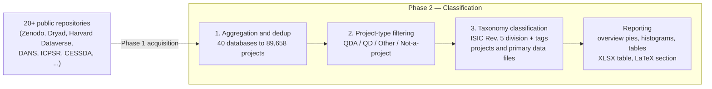

# QDArchive

A pipeline for building a large, deduplicated archive of qualitative and mixed-methods
research projects — acquired from public data repositories, merged from 40 independently
built student databases, and classified by project type and subject-matter taxonomy.



---

## Contents

- [What this is](#what-this-is)
- [Repository layout](#repository-layout)
- [Getting started](#getting-started)
- [Phase 1 — Data Acquisition](#phase-1--data-acquisition)
- [Phase 2 — Data Classification](#phase-2--data-classification)
  - [Step 1: Aggregation](#step-1-aggregation)
  - [Step 2: Project-type filtering](#step-2-project-type-filtering)
  - [Step 3: Taxonomy classification](#step-3-taxonomy-classification)
  - [Reporting & visualization](#reporting--visualization)
- [Scripts reference](#scripts-reference)
- [Further reading](#further-reading)

---

## What this is

Over 20 public data repositories (Zenodo, Dryad, Harvard Dataverse, DANS, UK Data Service,
CESSDA, ICPSR, and more) were scraped for research projects, each independently by a
different student as a class assignment — producing 40 separate SQLite databases with
overlapping content and inconsistent schemas.

QDArchive turns that into one coherent archive by:

1. **Aggregating** all 40 databases into a single deduplicated database (89,658 projects)
   with a canonical schema.
2. **Classifying** every project's `PROJECT_TYPE` — whether it contains actual
   qualitative-analysis (CAQDAS) project files, raw qualitative data, other recognizable
   data, or nothing usable at all.
3. **Classifying** every project against the **ISIC Rev. 5** industry taxonomy (Section →
   Division) plus freeform search tags, using local sentence-embedding similarity — no
   external API calls. For QDA and QD projects, **each primary data file** is classified as
   well.
4. **Reporting** the results per source repository: overview pie charts, primary-class
   histograms (all / QDA / QD), ranked class tables, a file-level distribution, an XLSX
   summary table, and a populated LaTeX section ready to drop into a paper.

## Repository layout

```text
QDArchive/
├── databases/                        39 other students' source SQLite databases (Phase 1 output)
├── docs/                             Design notes for each pipeline stage
│   ├── aggregation.md
│   ├── classification.md             (taxonomy classification)
│   ├── filtering.md                  (project-type classification)
│   └── database_links.md             provenance of every source database
├── scripts/                          One-liner `uv run` wrappers, one per pipeline stage
├── src/
│   ├── phase1_acquisition/           Scrapers + API clients that built the 39 databases
│   └── phase2_classification/
│       ├── aggregation/              Merge & dedupe the 39 databases into one
│       ├── classification/           PROJECT_TYPE filtering (QDA/QD/Other/Not-a-project)
│       ├── taxonomy/                 ISIC Rev.5 classification + tag generation
│       └── data_analysis/            Per-repository plots, tables, and LaTeX report generation
└── 23688981-sq26-classification.db   The aggregated, classified working database
```

## Getting started

Install dependencies with [uv](https://docs.astral.sh/uv/):

```shell
uv sync
```

Everything downstream of Phase 1 assumes the aggregated database
`23688981-sq26-classification.db` already exists at the project root — the pipeline
scripts in `scripts/` all default to it.

## Phase 1 — Data Acquisition

Code: `src/phase1_acquisition/` · Run: `bash scripts/run.sh`

Scrapers and API clients (`harvard_api.py`, `ihsn_api.py`, plus a generic `ingestor.py`)
pull project metadata and files from public repositories into a local SQLite database
following the schema in `database.py`. See [`docs/database_links.md`](docs/database_links.md)
for the full list of the 39 source databases this produced and where each one came from.

## Phase 2 — Data Classification

### Step 1: Aggregation

Code: `src/phase2_classification/aggregation/` · Run: `bash scripts/aggregate.sh` ·
Docs: [`docs/aggregation.md`](docs/aggregation.md)

Merges all 40 student databases (the 39 in `databases/` plus this student's own) into one,
resolving each source's table/column names against a canonical schema and deduplicating
projects via a fallback key chain (`project_url` → `doi` → `title + repository_id`). Child
records (files, keywords, licenses, person roles) are unioned and deduplicated per merged
project, not just concatenated. The result is 89,658 unique projects.

### Step 2: Project-type filtering

Code: `src/phase2_classification/classification/` · Run: `bash scripts/classify.sh` ·
Docs: [`docs/filtering.md`](docs/filtering.md)

Assigns every project a `type` — `QDA_PROJECT`, `QD_PROJECT`, `OTHER_PROJECT`, or
`NOT_A_PROJECT` — based purely on the file extensions present, checked in that priority
order. The QDA extension list (`qda_file_extensions.json`) covers native project files
from NVivo, ATLAS.ti, MAXQDA, QDA Miner, RQDA, Transana, QualCoder, HyperRESEARCH,
Quirkos, f4analyse, and the REFI-QDA exchange standard.

```shell
uv run src/phase2_classification/classification/list_qda_files.py
```

Lists every file in `FILES` matched against that extension list, if you need the raw
matches rather than the per-project rollup.

### Step 3: Taxonomy classification

Code: `src/phase2_classification/taxonomy/` · Run: `bash scripts/classify_taxonomy.sh` ·
Docs: [`docs/classification.md`](docs/classification.md)

Classifies every project against **ISIC Rev. 5** (Section → Division) and generates 5
freeform search tags — entirely offline, using a local `sentence-transformers` model
(`all-MiniLM-L6-v2`). Each of the 87 ISIC divisions is embedded once; each project's
title + description + keywords + file names are embedded and compared by cosine
similarity. The top-1 match becomes `primary_class`, the top-2 becomes `secondary_class`,
and `KeyBERT` (reusing the same embedding model) extracts the top 5 tags.

The script also classifies **each primary data file** in QDA and QD projects, writing
`primary_class`/`secondary_class` onto the `FILES` table. A file is classified from its
file name, falling back to its parent project's class when the name is uninformative. Use
`--scope` to control which pass runs (`projects`, `files`, or `all`; default `all`):

```shell
uv run src/phase2_classification/taxonomy/classify_taxonomy.py --scope files
```

### Reporting & visualization

Code: `src/phase2_classification/data_analysis/`

Once both classification steps have run, generate a full set of per-repository outputs:

```shell
bash scripts/plot_repo_taxonomy.sh
```

For every source repository, this writes to
`src/phase2_classification/data_analysis/output/by_repository/<repo>/`:

- **`primary_class_pie.svg`** / **`project_type_pie.svg`** — overview charts: the
  primary-class distribution (top 7 + Other) and the project-type composition (donut).
- **`primary_class_histogram.svg`** (+ `_qda`, `_qd`) — horizontal, white-background
  histograms of the top-20 primary classes, full ISIC division name as the label and the
  count annotated on each bar; one for all projects and one each restricted to QDA and QD
  project types.
- **`primary_class_table.csv`** (+ `_qda`, `_qd`) — the top 20 classes, ranked by frequency.
- **`file_primary_class_histogram.svg`** / **`file_primary_class_table.csv`** — the
  file-level distribution across primary data files (top-10 table).
- **`comments.md`** — auto-generated findings: a narrative summary, key facts (total
  projects, class diversity, dominant class), and the `QDA` / `QD` / `Other project` /
  `No project` breakdown.

A flat per-project summary table (the required XLSX deliverable columns —
`repository_id`, `project_type`, `project_title`, `primary_class`, `secondary_class`,
`no_project_files`) is produced by:

```shell
bash scripts/export_projects_summary.sh
```

There are also whole-archive (not per-repository) views:

```shell
bash scripts/plot_repositories.sh       # projects per source repository
bash scripts/plot_project_types.sh      # projects per PROJECT_TYPE
bash scripts/plot_taxonomy_classes.sh   # projects per primary/secondary ISIC class
```

Finally, turn the per-repository outputs into a ready-to-include LaTeX section:

```shell
uv run src/phase2_classification/data_analysis/generate_latex_report.py
```

This populates `classification_results.tex` — one `\subsection` per repository, laid out as
an overview page (narrative, key facts, and the two pie charts), a page of primary-class
histograms (all / QDA / QD), the ranked tables, and a file-level page (histogram + top-10
table). Figures are included via `\includesvg`, so the consuming document needs
`\usepackage[inkscapelatex=false]{svg}` and shell-escape enabled.

To publish the SVGs and the regenerated section straight into a separate LaTeX report
project (defaults to `../QDArchive-report`):

```shell
bash scripts/sync_report.sh [path/to/report]
```

## Scripts reference

| Script | Stage | What it runs |
| --- | --- | --- |
| `scripts/run.sh` | Phase 1 | Acquisition entry point |
| `scripts/aggregate.sh` | Phase 2 · Step 1 | Merge + dedupe the 39 source databases |
| `scripts/migrate_schema.sh` | Phase 2 · Step 1 | Apply schema corrections/migrations |
| `scripts/fix_repository_ids.sh` | Phase 2 · Step 1 | Correct unknown/mislabeled repository IDs |
| `scripts/classify.sh` | Phase 2 · Step 2 | Assign `PROJECT_TYPE` per project |
| `scripts/list_qda_files.sh` | Phase 2 · Step 2 | List every file matched as a QDA file |
| `scripts/classify_taxonomy.sh` | Phase 2 · Step 3 | Assign ISIC classes + tags per project (and per primary data file) |
| `scripts/plot_repositories.sh` | Reporting | Projects per source repository |
| `scripts/plot_project_types.sh` | Reporting | Projects per `PROJECT_TYPE` |
| `scripts/plot_taxonomy_classes.sh` | Reporting | Projects per primary/secondary ISIC class |
| `scripts/plot_repo_taxonomy.sh` | Reporting | Per-repository pies, histograms, tables, findings |
| `scripts/export_projects_summary.sh` | Reporting | Flat per-project summary table (XLSX columns) |
| `scripts/sync_report.sh` | Reporting | Push SVGs + generated section into the LaTeX report project |

## Further reading

- [`docs/database_links.md`](docs/database_links.md) — provenance of every one of the 39
  source databases (student repo + original data source).
- [`docs/aggregation.md`](docs/aggregation.md) — merge/dedup design in full detail.
- [`docs/filtering.md`](docs/filtering.md) — `PROJECT_TYPE` rule order and extension lists.
- [`docs/classification.md`](docs/classification.md) — ISIC taxonomy method and tagging.
